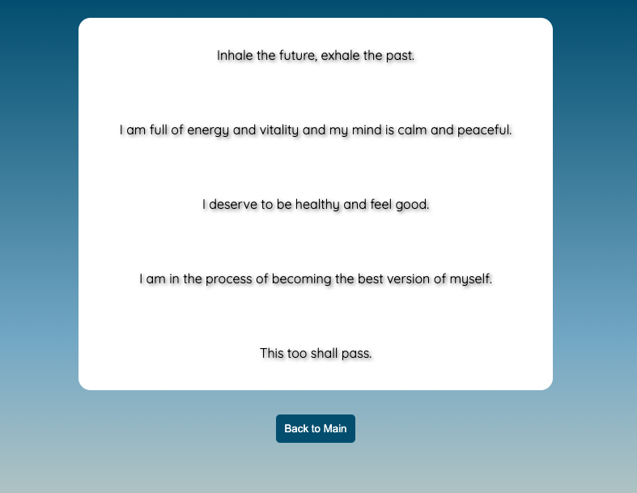

# Self-Care Center 

### Abstract:
[//]: <> (Briefly describe what you built and its features. What problem is the app solving? How does this application solve that problem?)

Self Care Center is application designed to promote and facilitate self-care and well-being. It's an attractive and engaging tool that generates positive affirmations and mantras and also allows users keep track of their favorite messages.

### Installation Instructions:
[//]: <> (What steps does a person have to take to get your app cloned down and running?)
Just from GitHub

### Preview of App:
[//]: <> (Provide ONE gif or screenshot of your application - choose the "coolest" piece of functionality to show off.)

### Context:
[//]: <> (Give some context for the project here. How long did you have to work on it? How far into the Turing program are you?)

We received this assignment on Tuesday 10/21 and it was due Sunday 10/29. We are 3 weeks into the Turing program.

### Contributors:
[//]: <> (Who worked on this application? Link to their GitHubs.)

Laura Long [GitHub](https://github.com/lalonggone)

### Learning Goals:
[//]: <> (What were the learning goals of this project? What tech did you work with?)

- Gain experience building an application that utilizes HTML, CSS and JavaScript
- Write HTML and CSS to match a provided comp
- Understand how to listen to and respond to user events
- Individualize your programming skill set

### Wins + Challenges:
[//]: <> (What are 2-3 wins you have from this project? What were some challenges you faced - and how did you get over them?)

CSS was a big win for me on this project. I feel like it was the most fun to mess around with and the concept generally came naturally to me. That's not to say it was easy! The workload of this project compared to last was not as big, so I was able to balance it out easier with whatever else was going on in my life like chores and some socializing with friends, so that's another win. The addToFavorites function was a tough one to do.. I'd like to go back to that code block and try to get a better understanding of what it's doing / why it works. Specifically the line: if (!favorites.includes(message) && message.trim() !== "") ... the message.trim and not operator ...
